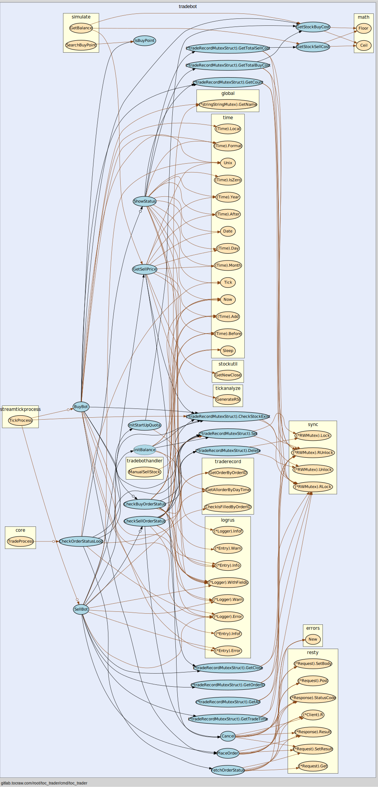

# TOC TRADER

[](https://gitlab.tocraw.com/root/toc_trader/-/commits/main)
[](https://gitlab.tocraw.com/root/toc_trader/-/commits/main)
[](https://gitlab.tocraw.com/root/toc_trader)
[](https://golang.org)
[](https://www.linux.org/)
[](https://www.docker.com/)

## Features

### Initialize

- 確認 `global.db` 是否存在，不存在則依照 `default key` 創建，有些有預設值
- 初始化 database(postgresql)
- 初始化 task
- 預設開啟 EnableBuy, EnableSell, MeanTimeTradeStockNum = ?
- 2021 休市日匯入資料庫，並會自動跳過
- 找出程式啟用當下的前兩個交易日及當下的交易日

### Servers

- 優先開啟 API server(default: 6670)，確認 port is open 才繼續以下動作
- [API Docs](http://toc-trader.tocraw.com:6670/swagger/index.html)

### Flows

- TradeID, TradePass 須於初次啟動初始化，不存在僅開放更新此值的 API
- Sysparm API 可更新 reset 於下次啟動時，初始化資料庫，開啟完畢後，reset 會歸零
- EnableBuy, EnableSell, MeanTimeTradeStockNum 可於程式進行中修改
- Docker Container 模式下，System API 可重啟服務
- 匯入所有股票
- 更新前一交易日目標股價及成交量
- 透過 sysparm 中條件篩選出股票（目前條件不可更改）
- 擷取當前日期的前一交易日所有搓合交易，並與訂閱做相同分析
- 每日 PM 3:00 之後才開放擷取當日 tick
- 啟動時，會檢查委託，如有成交買單，會扣除對應額度
- 訂閱目標的 Streamtick, bid-ask
- 每 1.5 秒確認委託狀態
- AM 4:00 會清除所有事件(委託)

### Git

```sh
git fetch --prune --prune-tags origin
git check-ignore *
```

### Simulation

- Forward

```log
WARN[2021/10/18 02:41:25] 2021-10-15 Forward Balance: -538, Stock: 2609, Name: 陽明, Total Time: 1168, 92.60, 92.30
WARN[2021/10/18 02:41:25] 2021-10-15 Forward Balance: 448, Stock: 2303, Name: 聯電, Total Time: 761, 58.20, 58.80
WARN[2021/10/18 02:41:25] 2021-10-15 Forward Balance: -743, Stock: 2603, Name: 長榮, Total Time: 808, 94.70, 94.20
WARN[2021/10/18 02:41:25] 2021-10-14 Forward Balance: -1739, Stock: 2603, Name: 長榮, Total Time: 230, 93.60, 92.10
WARN[2021/10/18 02:41:25] 2021-10-14 Forward Balance: 1768, Stock: 2609, Name: 陽明, Total Time: 1077, 88.00, 90.00
WARN[2021/10/18 02:41:25] 2021-10-14 Forward Balance: 353, Stock: 2303, Name: 聯電, Total Time: 1533, 56.70, 57.20
WARN[2021/10/18 02:41:25] 2021-10-13 Forward Balance: -450, Stock: 2303, Name: 聯電, Total Time: 369, 58.10, 57.80
WARN[2021/10/18 02:41:25] 2021-10-13 Forward Balance: -936, Stock: 2609, Name: 陽明, Total Time: 630, 92.00, 91.30
WARN[2021/10/18 02:41:25] 2021-10-13 Forward Balance: -1068, Stock: 2606, Name: 裕民, Total Time: 2684, 65.70, 64.80
WARN[2021/10/18 02:41:25] 2021-10-13 Forward Balance: -146, Stock: 2603, Name: 長榮, Total Time: 368, 95.20, 95.30
WARN[2021/10/18 02:41:25] Total Balance: -3051, TradeCount: 10
WARN[2021/10/18 02:41:25] Cond: {Model:{ID:43376 CreatedAt:2021-10-18 02:38:52.820999 +0800 CST UpdatedAt:2021-10-18 02:38:52.820999 +0800 CST DeletedAt:{Time:0001-01-01 00:00:00 +0000 UTC Valid:false}} HistoryCloseCount:2500 OutInRatio:55 ReverseOutInRatio:5 CloseDiff:0 CloseChangeRatioLow:-1 CloseChangeRatioHigh:8 OpenChangeRatio:4 RsiHigh:50.2 RsiLow:50 ReverseRsiHigh:50.2 ReverseRsiLow:50 TicksPeriodThreshold:7 TicksPeriodLimit:9.1 TicksPeriodCount:3 VolumePerSecond:3}
```

- Reverse

```log
WARN[2021/10/18 02:34:42] 2021-10-15 Reverse Balance: 654, Stock: 2603, Name: 長榮, Total Time: 183, 94.60, 95.50
WARN[2021/10/18 02:34:42] 2021-10-15 Reverse Balance: 359, Stock: 2609, Name: 陽明, Total Time: 298, 92.70, 93.30
WARN[2021/10/18 02:34:42] 2021-10-15 Reverse Balance: -51, Stock: 2303, Name: 聯電, Total Time: 448, 58.40, 58.50
WARN[2021/10/18 02:34:42] 2021-10-15 Reverse Balance: 543, Stock: 2606, Name: 裕民, Total Time: 2936, 60.10, 60.80
WARN[2021/10/18 02:34:42] 2021-10-14 Reverse Balance: 353, Stock: 2303, Name: 聯電, Total Time: 503, 56.80, 57.30
WARN[2021/10/18 02:34:42] 2021-10-14 Reverse Balance: 1155, Stock: 2603, Name: 長榮, Total Time: 260, 93.40, 94.80
WARN[2021/10/18 02:34:42] 2021-10-14 Reverse Balance: -1329, Stock: 2609, Name: 陽明, Total Time: 628, 89.50, 88.40
WARN[2021/10/18 02:34:42] 2021-10-14 Reverse Balance: -654, Stock: 2606, Name: 裕民, Total Time: 858, 59.90, 59.40
WARN[2021/10/18 02:34:42] 2021-10-14 Reverse Balance: 1565, Stock: 8121, Name: 越峰, Total Time: 988, 50.90, 52.60
WARN[2021/10/18 02:34:42] 2021-10-13 Reverse Balance: 955, Stock: 2603, Name: 長榮, Total Time: 239, 93.90, 95.10
WARN[2021/10/18 02:34:42] 2021-10-13 Reverse Balance: 349, Stock: 2303, Name: 聯電, Total Time: 484, 58.00, 58.50
WARN[2021/10/18 02:34:42] 2021-10-13 Reverse Balance: -1236, Stock: 2609, Name: 陽明, Total Time: 168, 92.30, 91.30
WARN[2021/10/18 02:34:42] 2021-10-13 Reverse Balance: 1224, Stock: 2606, Name: 裕民, Total Time: 601, 66.80, 68.20
WARN[2021/10/18 02:34:42] 2021-10-12 Reverse Balance: 2058, Stock: 2609, Name: 陽明, Total Time: 557, 92.20, 94.50
WARN[2021/10/18 02:34:42] 2021-10-12 Reverse Balance: -242, Stock: 3711, Name: 日月光投控, Total Time: 2069, 93.90, 93.90
WARN[2021/10/18 02:34:42] 2021-10-12 Reverse Balance: 2224, Stock: 2606, Name: 裕民, Total Time: 4259, 66.30, 68.70
WARN[2021/10/18 02:34:42] 2021-10-12 Reverse Balance: -352, Stock: 2303, Name: 聯電, Total Time: 644, 59.40, 59.20
WARN[2021/10/18 02:34:42] Total Balance: 7575, TradeCount: 17
WARN[2021/10/18 02:34:42] Cond: {Model:{ID:37659 CreatedAt:2021-10-18 02:29:41.251255 +0800 CST UpdatedAt:2021-10-18 02:29:41.251255 +0800 CST DeletedAt:{Time:0001-01-01 00:00:00 +0000 UTC Valid:false}} HistoryCloseCount:1500 OutInRatio:55 ReverseOutInRatio:5 CloseDiff:0 CloseChangeRatioLow:-1 CloseChangeRatioHigh:8 OpenChangeRatio:4 RsiHigh:50 RsiLow:50 ReverseRsiHigh:50 ReverseRsiLow:50 TicksPeriodThreshold:1 TicksPeriodLimit:1.3 TicksPeriodCount:2 VolumePerSecond:6}
```

### Trade Bot Service



## Authors

- [**Tim Hsu**](https://gitlab.tocraw.com/root)
