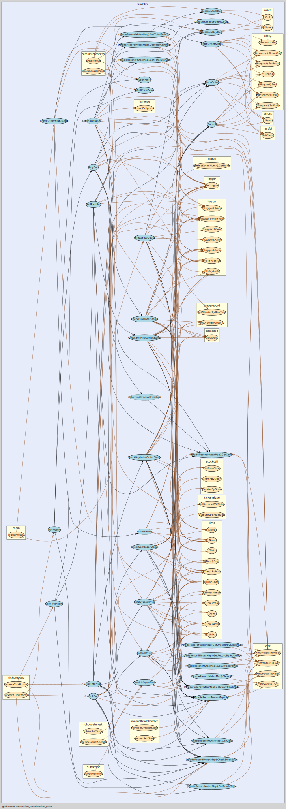

# TOC TRADER

[](https://gitlab.tocraw.com/root/toc_trader/-/commits/main)
[](https://gitlab.tocraw.com/root/toc_trader/-/commits/main)
[](https://gitlab.tocraw.com/root/toc_trader)
[](https://golang.org)
[](https://www.linux.org/)
[](https://www.docker.com/)

## Features

[API Docs](http://toc-trader.tocraw.com:6670/swagger/index.html)

## Query Best Condition

```sql
SELECT * FROM simulate_result AS a LEFT JOIN simulate_cond AS b ON a.cond_id=b.id
WHERE positive_days=total_days AND trade_count!=total_days AND total_loss<balance AND forward_balance!=0
order by (balance-total_loss)/trade_count DESC, rsi_high DESC;

SELECT * FROM simulate_result AS a LEFT JOIN simulate_cond AS b ON a.cond_id=b.id
WHERE positive_days=total_days AND trade_count!=total_days AND total_loss<balance AND reverse_balance!=0
order by (balance-total_loss)/trade_count DESC, rsi_low ASC;
```

### Git

```sh
git fetch --prune --prune-tags origin
git check-ignore *
```

### Result and Conditions Sample

```json
```

### Balance Sample

```json
[
  {
    "trade_day": "2021-11-24T08:00:00+08:00",
    "trade_count": 4,
    "forward": 709,
    "reverse": 0,
    "original_balance": 709,
    "discount": 229,
    "total": 938
  },
  {
    "trade_day": "2021-11-25T08:00:00+08:00",
    "trade_count": 7,
    "forward": 0,
    "reverse": 783,
    "original_balance": 783,
    "discount": 424,
    "total": 1207
  },
  {
    "trade_day": "2021-11-26T08:00:00+08:00",
    "trade_count": 3,
    "forward": -450,
    "reverse": 819,
    "original_balance": 369,
    "discount": 139,
    "total": 508
  },
  {
    "trade_day": "2021-11-29T08:00:00+08:00",
    "trade_count": 3,
    "forward": 12,
    "reverse": -309,
    "original_balance": -297,
    "discount": 123,
    "total": -174
  },
  {
    "trade_day": "2021-11-30T08:00:00+08:00",
    "trade_count": 9,
    "forward": -1896,
    "reverse": 13,
    "original_balance": -1883,
    "discount": 474,
    "total": -1409
  },
  {
    "trade_day": "2021-12-01T08:00:00+08:00",
    "trade_count": 15,
    "forward": -3378,
    "reverse": -4961,
    "original_balance": -8339,
    "discount": 1007,
    "total": -7332
  }
]
```

### Trade Bot Service



## Authors

- [**Tim Hsu**](https://gitlab.tocraw.com/root)
